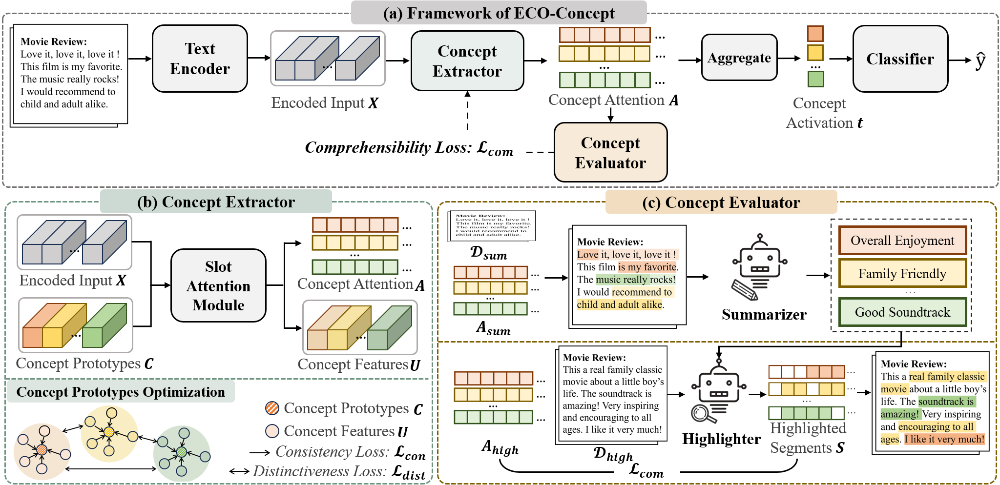

# ECo-Concept

Official repository for ["**Enhancing the Comprehensibility of Text Explanations via Unsupervised Concept Discovery**"](https://arxiv.org/abs/2505.20293), which has been accepted by ACL 2025 Findings.

[Chinese Blog](https://mp.weixin.qq.com/s/sNgQQ9wrLVa4LfCDI6FdCQ)



## Dataset

You can use your own dataset by modifying the `data_path` in the corresponding scripts. Make sure your dataset includes `train.json`, `val.json`, and `test.json`. In every json file:

- the `content` identifies the content of the sample.
- the `label` identifies the corresponding label of the sample.

## Code

### Requirements

- python==3.9.19

- CUDA: 11.3

- Python Packages:

  ```
  pip install -r requirements.txt
  ```

### Pretrained Models

You can download pretrained models ([bert-base-uncased](https://huggingface.co/google-bert/bert-base-uncased) and [roberta-base](https://huggingface.co/FacebookAI/roberta-base)) and change paths (`bert_path`) in the corresponding scripts.

### Run

Main Parameter Configuration:

- `base_model_name`:  Name of the pretrained model used.
- `task`: Name of the target dataset.
- `num_classes`: Number of classes in the classification task.
- `num_concepts`: Number of concepts to extract.
- `dist_weight`: Weight for the distinctiveness loss.
- `con_weight`: Weight for the consistency loss.
- `com_weight`: Weight for the comprehensibility loss.
- `vis_threshold`: Threshold for concept visualization.
- `model_path`: Path to save the trained model.
- `checkpoint_path`: Path to load saved model checkpoints.
- `prompt_path`: Path for prompts and summaries results.
- `simulation_path`: Path to save simulation results.
- `if_retrain`: Whether to execute the Concept Comprehensibility Enhancement Stage.


## How to Cite

```
@misc{sun2025enhancing,
  title={Enhancing the Comprehensibility of Text Explanations via Unsupervised Concept Discovery},
  author={Sun, Yifan and Wang, Danding and Sheng, Qiang and Cao, Juan and Li, Jintao},
  year={2025},
  eprint={2505.20293},
  archivePrefix={arXiv},
  primaryClass={cs.CL},
  url = {https://arxiv.org/abs/2505.20293}
}
```